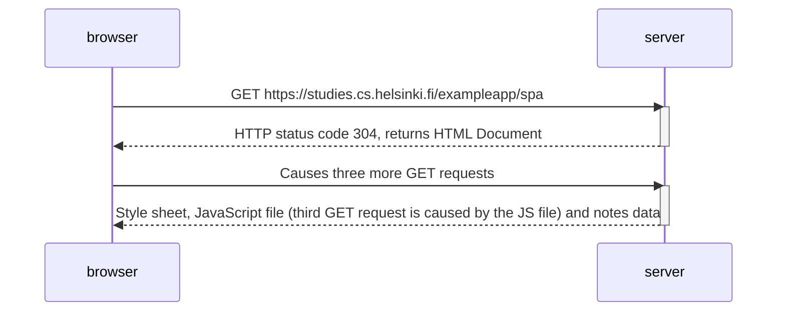

```mermaid
sequenceDiagram
    participant browser
    participant server

    browser ->> server: GET https://studies.cs.helsinki.fi/exampleapp/spa

    activate server
    server -->> browser: HTTP status code 304,  returns HTML Document
    deactivate server

    browser ->> server: Causes three more GET requests

    activate server
    server -->> browser: Style sheet, JavaScript file (third GET request is caused by the JS file) and notes data
    deactivate server
```
