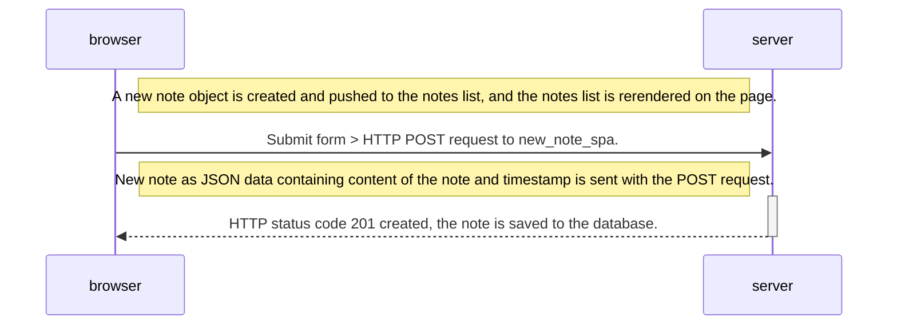

```mermaid
sequenceDiagram
    participant browser
    participant server

    Note right of browser: A new note object is created and pushed to the notes list, and the notes list is rerendered on the page.

    browser ->> server: Submit form > HTTP POST request to  new_note_spa.

    Note left of server: New note as JSON data containing content of the note and timestamp is sent with the POST request.

    activate server
    server -->> browser: HTTP status code 201 created, the note is saved to the database.
    deactivate server

```